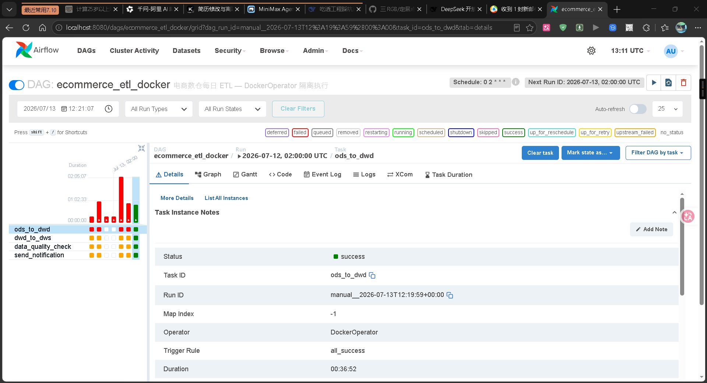
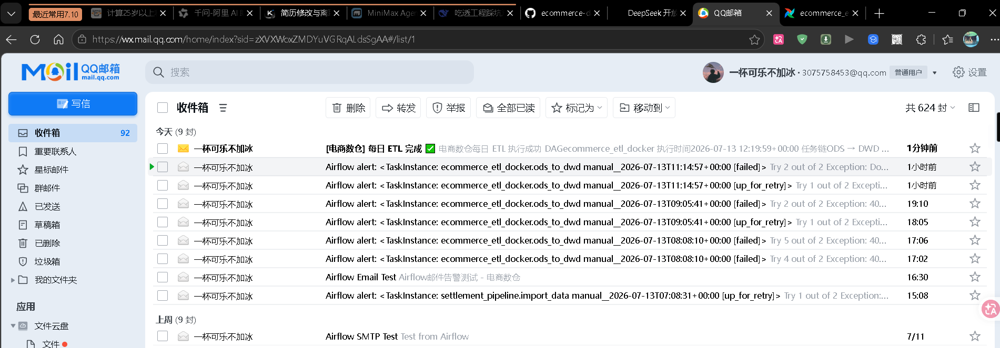

# 电商数仓项目 E-Commerce Data Warehouse

> **5 周完成端到端数仓 + Airflow 自动化 ETL 编排**
> 100 万订单 · 4 层数仓分层 · 6 道面试 SQL · Airflow 自动化调度



*图：DockerOperator + LocalExecutor — 4 任务全绿，50 分钟跑完 320 万行*

---

## 项目简介

本项目是一个**端到端的电商数据仓库系统**,模拟真实电商业务场景,完整覆盖:

- ✅ **数据生成**:Python + Faker 造 100 万订单测试数据
- ✅ **4 层数仓**:ODS(原始)→ DWD(清洗)→ DWS(主题宽表)→ ADS(业务指标，规划中)
- ✅ **6 道面试高频 SQL**:留存率、转化漏斗、复购周期、连续登录等
- ✅ **RFM 客户分层**:8 类客户标签 + 营销策略匹配
- ✅ **Airflow 自动化 ETL**:Docker 部署,4 任务 DAG,每天自动跑

**这是数据岗候选人最完整的"数仓 + Airflow"作品集。**

---

## 数据规模(Week 4 验证)

| 表 | 条数 | 说明 |
|---|---|---|
| `ods_users` | **100,000** | 过去 2 年注册 |
| `ods_products` | **5,000** | 5 个一级类目(服装/3C/美妆/食品/家居) |
| `ods_orders` | **1,000,000** | 过去 1 年,5 种状态 |
| `ods_order_items` | **2,099,785** | 1 单 1-5 件商品(不重复) |
| `dws_user_summary` | **100,000** | + RFM 8 类客户标签 |
| `dws_product_summary` | **5,000** | + 品类内排名 |
| `dws_date_summary` | **366** | + DAU/GMV/月度趋势 |
| **总数据量** | **3,204,785** 行 | 全部进 MySQL 8.0 |

---

## 5 周学习路径

| 周 | 主题 | 核心产出 | 关键技能 |
|---|---|---|---|
| **Week 1** | 造数据 | 100 万订单测试数据 | Python + Faker + pandas |
| **Week 2** | ODS 层 | 4 张表,320 万行入 MySQL | SQLAlchemy + pymysql + DDL 设计 |
| **Week 3** | DWD 层 | 2 张表 + 6 道面试 SQL(留存 15.5%) | 维度退化 + 窗口函数 + 业务标记 |
| **Week 4** | DWS 层 | 3 张宽表 + RFM 8 类客户分层 | NTILE + CASE + 主题宽表 |
| **Week 5** | Airflow | Docker 部署 + 4 任务 DAG 跑通 | 容器化 + 跨平台路径 + 调度编排 |

---

## 技术栈

- **Python 3.13** — 数据生成、ETL 脚本
- **MySQL 8.0** — 数仓存储(4 层)
- **Apache Airflow 2.10** — ETL 调度编排(Docker 部署)
- **Docker Desktop** — Airflow 容器化
- **Git + GitHub** — 版本管理
- **PyCharm** — 开发环境

---

## 项目结构

```
ecommerce-data-warehouse/
├── 01-data-generation/         # Week 1 - 数据生成(100万订单)
│   ├── generate_users.py
│   ├── generate_products.py
│   ├── generate_orders.py       # 关键:用 random.sample 避免主键冲突
│   └── run_all.py
├── 02-ods-layer/              # Week 2 - ODS 原始层
│   ├── ddl/                     # 4 张表的 MySQL DDL
│   ├── scripts/
│   │   ├── load_to_mysql.py     # SQLAlchemy + pymysql
│   │   └── test_ods_mysql.py
│   └── queries/ods_queries.sql
├── 03-dwd-layer/              # Week 3 - DWD 清洗层
│   ├── ddl/
│   ├── scripts/
│   │   ├── load_to_dwd.py      # 维度退化 + 业务标记
│   │   └── test_dwd.py
│   └── queries/
│       ├── dwd_queries.sql
│       └── interview_questions.sql   # 6 道面试 SQL
├── 04-dws-layer/              # Week 4 - DWS 主题宽表
│   ├── ddl/
│   ├── scripts/
│   │   ├── load_to_dws.py      # 3 张宽表 + RFM 8 类客户
│   │   └── test_dws.py
│   └── queries/
│       ├── dws_queries.sql
│       └── rfm_segmentation.sql  # RFM 客户分层
├── docker-compose.airflow.yml    # Airflow 集群编排（postgres + webserver + scheduler）
├── .env.airflow                  # 环境变量（SMTP 密码等）
├── docker/                       # Docker 镜像
│   ├── airflow/Dockerfile        # Airflow 镜像（预装 docker provider）
│   └── etl/
│       ├── Dockerfile            # ETL 任务镜像（pymysql + pandas + 脚本）
│       └── entrypoint.sh         # 容器入口脚本
├── 07-airflow-dag/               # Week 5 - Airflow 调度
│   ├── dags/
│   │   ├── hello_world.py               # 第一个 DAG
│   │   └── ecommerce_etl_docker.py      # DockerOperator 版 ETL DAG（4 任务全绿）
│   ├── plugins/                          # Airflow 插件目录
│   ├── scripts/
│   │   └── quality_check.py              # 数据质量校验脚本
│   └── airflow-practice-log.md           # 实战复盘（7 个坑 + 架构演进）
├── data/                       # 原始 CSV(不进 Git)
├── docs/                       # 文档与截图
│   ├── learning-journey.md     # 5 周学习旅程（17 个工程坑 + 6 道 SQL）
│   └── images/                 # 截图
│       ├── airflow-ecommerce-etl-success.png
│       └── airflow-ecommerce-etl-email-alert.png
├── requirements.txt            # 本机 ETL 依赖(7 个)
├── eco_venv/                   # 本地 venv(不进 Git)
├── backups/                    # MySQL 备份(360MB)
└── README.md                   # 你正在看的这个文件
```

---

## 6 道面试高频 SQL(默写级)

### 1. 7 日留存率 ⭐⭐⭐
```sql
WITH first_orders AS (
    SELECT user_id, MIN(order_date) AS first_date
    FROM dwd_orders
    WHERE is_valid_order = 1
    GROUP BY user_id
),
user_activity AS (
    SELECT DISTINCT user_id, order_date
    FROM dwd_orders WHERE is_valid_order = 1
)
SELECT
    f.first_date,
    COUNT(DISTINCT f.user_id) AS new_users,
    ROUND(COUNT(DISTINCT CASE
        WHEN DATEDIFF(u.order_date, f.first_date) BETWEEN 1 AND 7
        THEN f.user_id END) * 100.0 / COUNT(DISTINCT f.user_id), 2
    ) AS d7_retention_pct
FROM first_orders f
LEFT JOIN user_activity u ON f.user_id = u.user_id
GROUP BY f.first_date;
```

### 2. 转化漏斗
```sql
SELECT
    COUNT(DISTINCT user_id) AS step1,
    COUNT(DISTINCT CASE WHEN status IN ('paid','shipped','received') THEN user_id END) AS step2,
    COUNT(DISTINCT CASE WHEN status IN ('shipped','received') THEN user_id END) AS step3,
    COUNT(DISTINCT CASE WHEN status = 'received' THEN user_id END) AS step4
FROM dwd_orders;
```

### 3. 复购率
```sql
WITH user_orders AS (
    SELECT user_id, COUNT(*) AS cnt
    FROM dwd_orders WHERE is_valid_order = 1
    GROUP BY user_id
)
SELECT
    ROUND(SUM(CASE WHEN cnt >= 2 THEN 1 ELSE 0 END) * 100.0 / COUNT(*), 2) AS repurchase_pct
FROM user_orders;
```

### 4. 复购周期分布
```sql
WITH orders_with_prev AS (
    SELECT user_id, create_time,
           LAG(create_time) OVER (PARTITION BY user_id ORDER BY create_time) AS prev_time
    FROM dwd_orders WHERE is_valid_order = 1
)
SELECT
    CASE
        WHEN DATEDIFF(create_time, prev_time) BETWEEN 0 AND 7 THEN '0-7天'
        WHEN DATEDIFF(create_time, prev_time) BETWEEN 8 AND 30 THEN '8-30天'
        WHEN DATEDIFF(create_time, prev_time) BETWEEN 31 AND 90 THEN '31-90天'
        ELSE '90天以上'
    END AS interval_range,
    COUNT(*) AS repurchase_count
FROM orders_with_prev
WHERE prev_time IS NOT NULL
GROUP BY interval_range
ORDER BY MIN(DATEDIFF(create_time, prev_time));
```

### 5. 连续 N 天有订单(进阶)
```sql
WITH daily_orders AS (
    SELECT DISTINCT user_id, order_date
    FROM dwd_orders WHERE is_valid_order = 1
),
with_groups AS (
    SELECT user_id, order_date,
           DATE_SUB(order_date, INTERVAL ROW_NUMBER() OVER (PARTITION BY user_id ORDER BY order_date) DAY) AS grp
    FROM daily_orders
)
SELECT consecutive_days, COUNT(*) AS user_count
FROM (SELECT user_id, grp, COUNT(*) AS consecutive_days FROM with_groups GROUP BY user_id, grp) t
WHERE consecutive_days >= 3
GROUP BY consecutive_days
ORDER BY consecutive_days;
```

### 6. 新老客消费对比
```sql
SELECT
    DATE_FORMAT(order_date, '%Y-%m') AS month,
    COUNT(DISTINCT CASE WHEN is_first_order = 1 THEN user_id END) AS new_buyers,
    COUNT(DISTINCT CASE WHEN is_first_order = 0 THEN user_id END) AS returning_buyers,
    ROUND(SUM(CASE WHEN is_first_order = 1 THEN total_amount ELSE 0 END), 2) AS new_buyer_gmv
FROM dwd_orders
WHERE is_valid_order = 1
GROUP BY month ORDER BY month;
```

---

## RFM 客户分层结果

| 客户分层 | 用户数 | 占比 | 营销策略 |
|---------|--------|------|----------|
| 重要价值客户 | 13,125 | 13.1% | VIP 专属服务 + 新品优先 |
| 重要发展客户 | 8,343 | 8.3% | 推送新客优惠券 |
| 重要保持客户 | 1,910 | 1.9% | 定期唤醒邮件 |
| 重要挽留客户 | 2,563 | 2.6% | 大额优惠券 + 客服主动联系 |
| 一般价值客户 | 1,985 | 2.0% | 偶尔推送 |
| 一般发展客户 | 1,971 | 2.0% | 新客礼包 |
| 一般保持客户 | 8,523 | 8.5% | 标准推送 |
| 流失客户 | 61,564 | 61.6% | 不投入营销资源 |

---

## Airflow 部署

### 架构：DockerOperator + LocalExecutor

```
docker compose up
  ├── postgres              — Airflow 元数据库
  ├── airflow-webserver     — Web UI (:8080)
  ├── airflow-scheduler     — LocalExecutor + DockerOperator
  │    └── /var/run/docker.sock 挂载 → 启临时容器
  └── 临时 ETL 容器          — ecommerce-etl:latest
       ├── ods_to_dwd           (~37 min)
       ├── dwd_to_dws           (~13 min)
       ├── data_quality_check   (2 sec)
       └── send_notification    (3 sec, EmailOperator)
```

> 最初尝试了 standalone 单进程模式，因 webserver 不稳定、无法并行而被淘汰。最终采用 docker-compose 多服务 + DockerOperator 方案，Task 之间容器隔离、互不影响。

### 快速启动

```bash
# 1. 构建 ETL 镜像
docker build -f docker/etl/Dockerfile -t ecommerce-etl:latest .

# 2. 启动 Airflow 集群
docker compose -f docker-compose.airflow.yml --env-file .env.airflow up -d

# 3. 浏览器打开 http://localhost:8080（admin / admin）
# 4. 手动触发 ecommerce_etl_docker DAG，或等每天凌晨 2 点自动调度
```

### 电商 ETL DAG 结构

```python
# 4 个任务串行执行（TRUNCATE + INSERT 不能并行，max_active_runs=1）:
[ods_to_dwd] → [dwd_to_dws] → [data_quality_check] → [send_notification]
    ~37 min         ~13 min           2 sec                 3 sec
```

**Schedule**: 每天凌晨 2 点自动跑  
**Trigger**: Web UI 手动触发 或 CLI `docker exec airflow-scheduler airflow dags trigger ecommerce_etl_docker`

### 邮件告警



*图：ETL 完成后自动发送 HTML 邮件通知（EmailOperator）*

---

## 真实数据亮点(从 MySQL 查出来)

```
订单状态分布:
  paid      649,339 (64.93%)  ← 已支付,主力
  shipped   150,231 (15.02%)  ← 已发货
  received  100,469 (10.05%)  ← 已收货
  cancelled  50,100 ( 5.01%)
  refunded   49,861 ( 4.99%)

7 日留存率:15.5%(行业平均 10-20%) ⭐
复购周期:60% 在 30 天内
月度 GMV:6-7 亿(2025-07 至 2026-01 高峰)
```

---

## 简历项目描述(直接复制)

> **端到端电商数仓 + Airflow 自动化 ETL 编排**
>
> - 设计 4 层数仓架构(ODS / DWD / DWS / ADS 规划中),处理 100 万订单 320 万明细
> - 用 SQLAlchemy + pymysql 把 320 万行数据导入 MySQL 8.0
> - 实现 6 道面试高频 SQL(留存率 15.5%、转化漏斗、复购周期、连续登录)
> - 用 DWS 3 张宽表(用户/商品/时间)+ RFM 8 类客户分层,识别 13,125 个重要价值客户
> - 部署 Apache Airflow 2.10 到 Docker,设计电商 ETL DAG(ODS→DWD→DWS→校验→通知)
> - 解决 7 个真实工程坑:MySQL 元数据锁死锁、Docker auto_remove 冲突、Web UI 403、并发控制、Docker 网络性能、Git Bash 路径转换、docker-compose YAML 解析等
>
> **GitHub**: https://github.com/Three-rgb/ecommerce-data-warehouse

---

## 关键学习(Week 1-5 复盘)

| Week | 关键学习 |
|------|----------|
| 1 | Python 造数据要符合业务(主键冲突、状态分布) |
| 2 | DDL 设计要符合数仓原则(主键、索引、字符集) |
| 3 | 维度退化(避免 JOIN)、业务标记(有效订单/首单) |
| 4 | 主题宽表 + RFM 评分(NTILE 分 5 档 + 8 类客户) |
| 5 | DockerOperator + LocalExecutor 集群部署,4 任务 DAG 全绿,邮件告警 |

详见:
- [`docs/learning-journey.md`](./docs/learning-journey.md) - 5 周完整学习旅程
- [`07-airflow-dag/airflow-practice-log.md`](./07-airflow-dag/airflow-practice-log.md) - Airflow 部署复盘（7 个坑）

---

## 依赖说明

项目拆成两份依赖配置,因为 Airflow 是单独跑在 Docker 容器里的,本机 venv 不需要装它。

| 文件 | 用途 | 用在哪儿 |
|---|---|---|
| **[requirements.txt](./requirements.txt)** | Python ETL 脚本依赖 | 本机 venv |
| **docker/etl/Dockerfile** | Airflow ETL 容器依赖（`pip install` 直接写在 Dockerfile 里） | Docker 容器内构建 |

### requirements.txt — 本机 ETL 脚本

`pandas / numpy / Faker / tqdm / pyarrow`(数据生成)+ `PyMySQL / SQLAlchemy`(ODS→DWS 入库)共 7 个。

### docker/etl/Dockerfile — ETL 容器

只装 ETL Task 需要的 `pymysql + pandas`,刻意不带 `Faker / tqdm / SQLAlchemy` 等用不到的包,镜像更小、构建更快。

---

## 快速开始(本机)

```bash
# 1. 克隆仓库
git clone https://github.com/Three-rgb/ecommerce-data-warehouse.git
cd ecommerce-data-warehouse

# 2. 创建 Python 虚拟环境
python -m venv venv
.\venv\Scripts\Activate.ps1

# 3. 装依赖
pip install -r requirements.txt

# 4. 启动 MySQL(假设你已经装了)
net start mysql

# 5. 一键造数据
cd 01-data-generation
python run_all.py

# 6. 入 ODS 层
cd ..\02-ods-layer\scripts
python load_to_mysql.py

# 7. 入 DWD 层
cd ..\..\03-dwd-layer\scripts
python load_to_dwd.py

# 8. 入 DWS 层
cd ..\..\04-dws-layer\scripts
python load_to_dws.py

# 9. 构建 ETL 镜像 + 启动 Airflow 集群
docker build -f docker/etl/Dockerfile -t ecommerce-etl:latest .
docker compose -f docker-compose.airflow.yml --env-file .env.airflow up -d

# 浏览器 http://localhost:8080 (admin / admin)
# 触发 ecommerce_etl_docker DAG,4 任务自动跑
```

---

## 贡献

这是个人学习项目,但欢迎:
- 提 Issue 讨论问题
- 提 PR 改进代码
- Fork 改成你自己的数仓项目

---

## License

MIT License

---

## 关于作者

**Three-rgb** — 数据岗求职候选人

- 5 周从 0 基础完成端到端数仓 + Airflow 自动化
- 7 个真实 Airflow 工程坑(MySQL 元数据锁、Docker auto_remove、Web UI 403 等)
- GitHub: [@Three-rgb](https://github.com/Three-rgb)

---

**⭐ 如果这个项目对你有帮助,给个 Star!**
